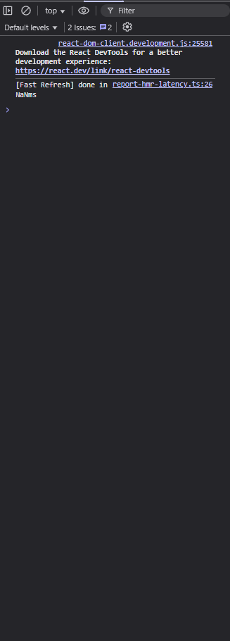
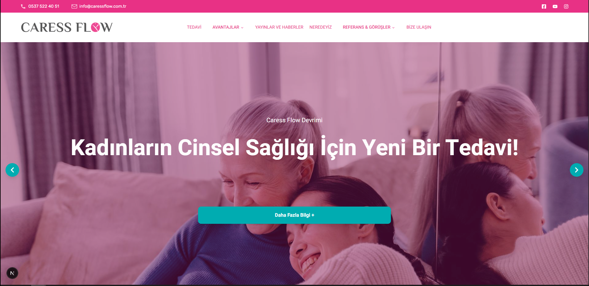
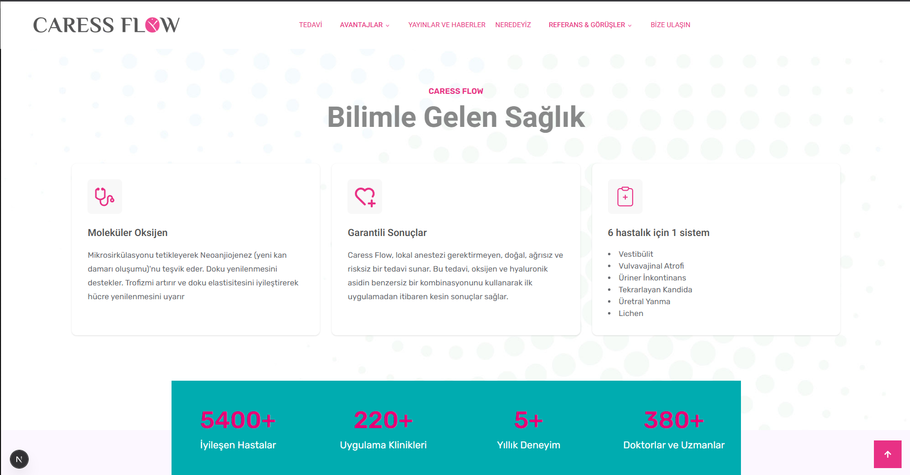
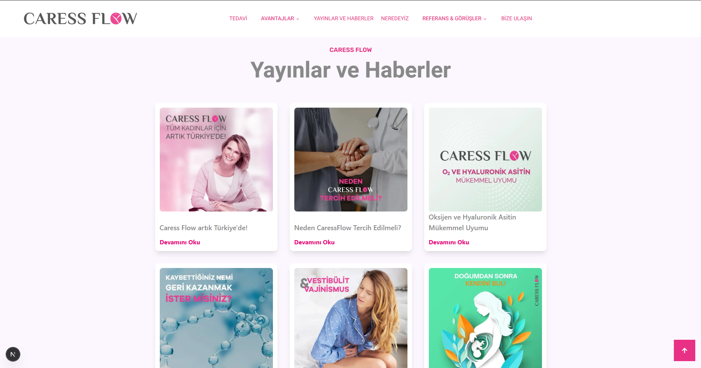
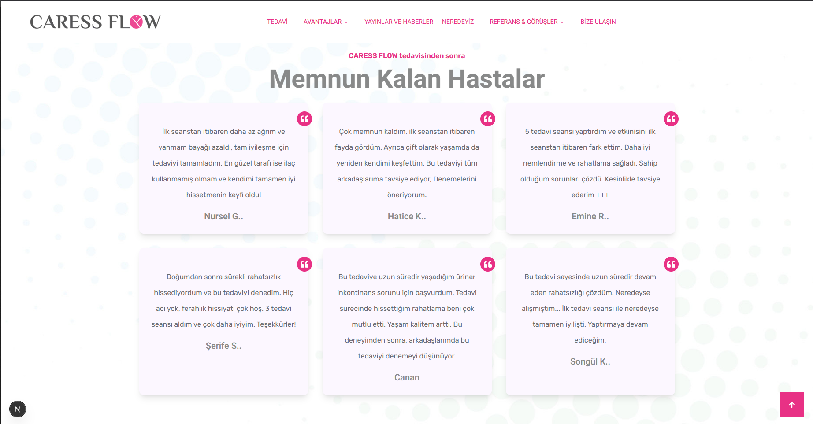
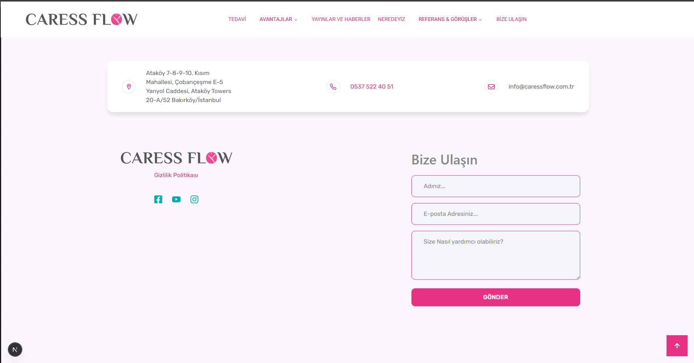
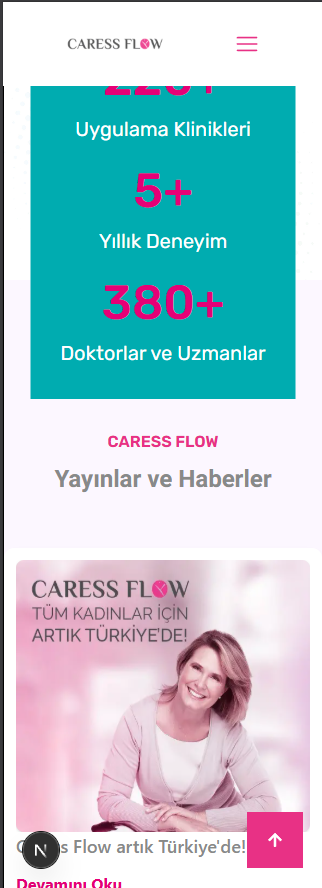
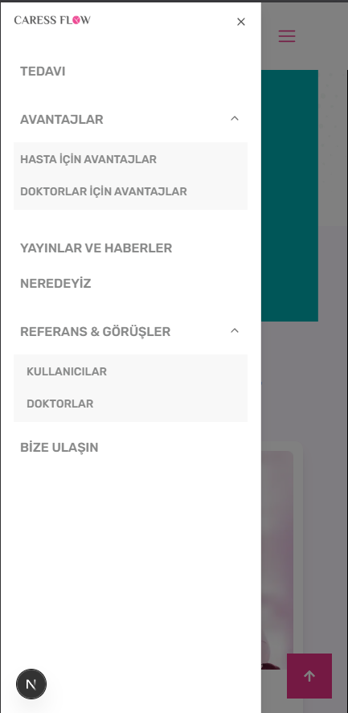

# Case Study Landing Page

Bu proje, basit bir responsive **landing page** örneğidir.  
Animasyonlar, küçük state yönetimleri ve temel etkileşimler içerir.

## 📂 Proje Dizini
Tüm kaynak kod **`client/`** klasörü altında yer almaktadır.

## 🚀 Kurulum ve Çalıştırma

1. **Client dizinine gidin:**
   ```bash
   cd client
   npm install
   npm run dev
   ```
## 🛠️ Teknolojiler
- **Next.js**
- **React**
- **Tailwind CSS**
- **Framer Motion**
- **ShadCN UI**

   # Ekran Görüntüleri












   # Responsive




   
